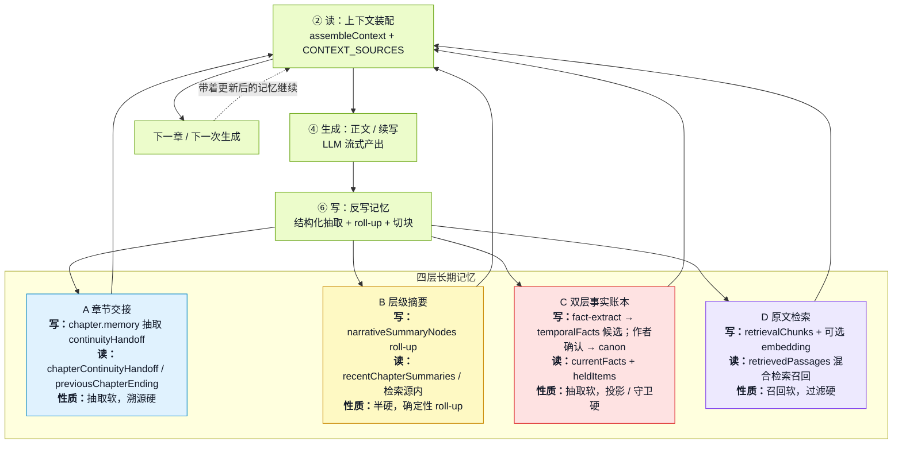
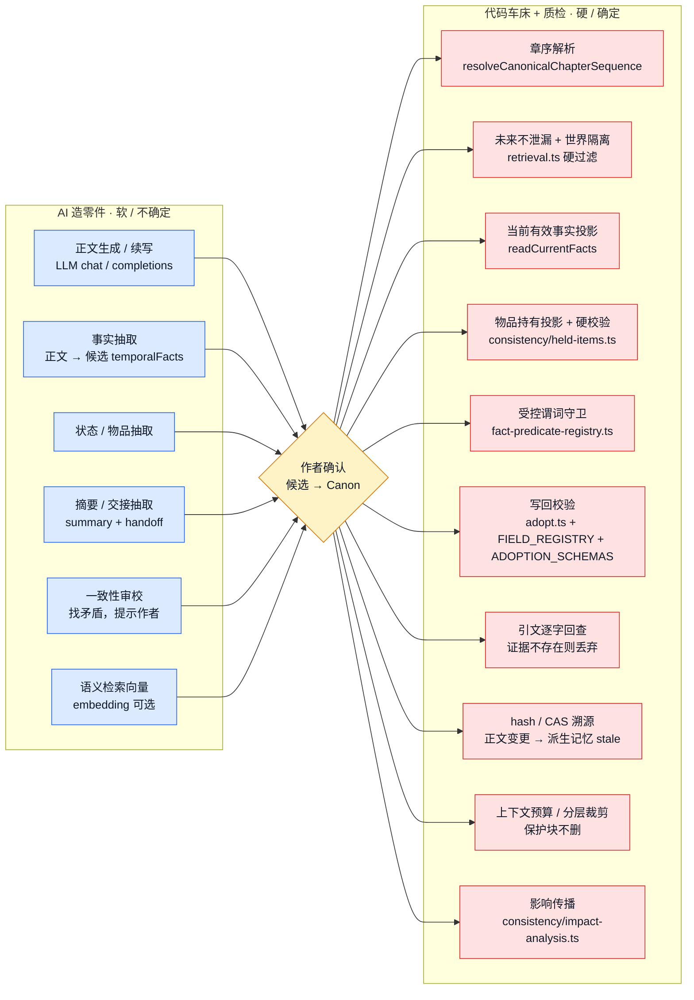
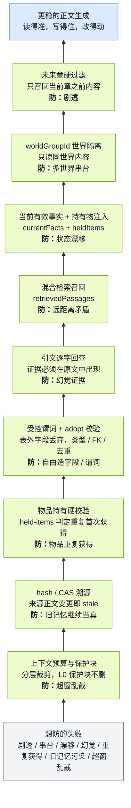

# StoryForge · 生成逻辑与长期一致性图集

> 基于《StoryForge · 生成逻辑与长期一致性运作 · 全局梳理》（2026-07-07）。
> 这份图集用于快速说明：正文怎么生成、长期一致性如何嵌入生成闭环、AI 与代码的职责边界、以及系统用哪些护栏稳住生成。

---

## 图 1 · 主生成管线

> 一条内容的一生：AI 写（软）→ AI 抽成结构（软）→ 作者确认（变硬 = canon）→ 代码核对新内容不违反它 + 它一变就传播失效（硬）。

```mermaid
flowchart LR
  start(("开始"))

  s1["① 触发<br/>用户点生成正文 / 续写<br/><b>入口：</b>ChapterEditor"]
  s2["② 上下文装配<br/><b>assembleContext(need)</b><br/>CONTEXT_SOURCES 按需拉取、分层、预算裁剪<br/><b>一致性的读入口</b>"]
  s3["③ Prompt 渲染<br/>renderPrompt(模板)<br/>chapter-adapter 连续性保护块"]
  s4["④ 生成<br/><b>软 / AI</b><br/>streamChat → LLM 流式产出正文"]
  s5["⑤ 采纳落库<br/><b>硬 / 结构化写回</b><br/>adopt() + FIELD_REGISTRY + ADOPTION_SCHEMAS<br/>类型 / 枚举 / FK / 去重校验"]
  s6["⑥ 反写记忆<br/><b>软抽取</b><br/>从新正文抽取结构<br/>沉淀进四层记忆"]
  s7["⑦ 校验<br/><b>软 + 硬混合</b><br/>LLM 一致性审校 + 确定性硬校验<br/>ReviewPanel 提示作者"]
  s8["⑧ 修改传播<br/><b>硬</b><br/>正文 hash 失效 + 影响分析<br/>派生记忆 stale / 后续章待复核"]

  start --> s1 --> s2 --> s3 --> s4 --> s5 --> s6 --> s7 --> s8
  s8 -. "下一章 / 下一轮生成" .-> s2

  classDef soft fill:#dbeafe,stroke:#2563eb,color:#111827
  classDef hard fill:#fee2e2,stroke:#dc2626,color:#111827
  classDef mixed fill:#fef3c7,stroke:#d97706,color:#111827
  classDef heart fill:#ecfccb,stroke:#65a30d,color:#111827

  class s2,s6 heart
  class s4 soft
  class s5,s8 hard
  class s7 mixed
```

---

## 图 2 · 四层记忆闭环

> 四层记忆都有写入点和读取点。第 ② 步装配负责读，第 ⑥ 步反写负责把新正文里的事实沉淀回记忆，下一轮再读回来。

---

## 图 3 · 软硬分界

> AI 负责创造和抽取；代码负责核对、簿记、结构、失效。作者确认是软 → 硬的闸门。

---

## 图 4 · 稳固生成护栏栈

> 护栏不是单一模块，而是沿着生成线分布：读之前过滤，写之前校验，写之后溯源，改动后传播。

